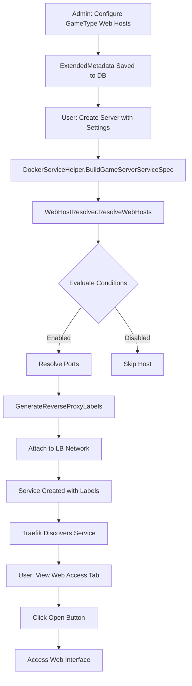

# Web Hosts Feature - Implementation Summary

## ✅ Completed Components

### Backend Services
1. ✅ **`WebHostDefinition` Model** - Defines web interface configuration with conditional logic
2. ✅ **`WebHostResolver` Service** - Evaluates conditions and resolves dynamic ports
3. ✅ **`DockerServiceHelper` Updates** - Generates Traefik labels automatically
4. ✅ **DI Registration** - `WebHostResolver` registered in `Program.cs`
5. ✅ **Test Updates** - `DockerServiceHelperTests` updated with resolver

### UI Components
1. ✅ **`WebHostsEditor.razor`** - Manage web hosts in GameType metadata (CRUD + Reorder)
2. ✅ **`WebHostDialog.razor`** - Dialog for adding/editing web host definitions
3. ✅ **`WebHostsPreview.razor`** - Real-time preview in Server Editor (Settings tab)
4. ✅ **`WebHostsDisplay.razor`** - Read-only display for ServerDetails page
5. ✅ **ExtendedMetadataEditor Integration** - New "Web Hosts" tab added
6. ✅ **EditServer Integration** - Real-time preview in Settings tab
7. ✅ **ServerDetails Integration** - New "Web Access" tab added (conditional)

### Documentation
1. ✅ **`REVERSE-PROXY-CONFIGURATION.md`** - Technical architecture and configuration guide
2. ✅ **`WEB-HOSTS-UI-GUIDE.md`** - User-facing UI guide with examples

## 🎯 Key Features

### Declarative Configuration
- Define **what** web interfaces exist, not **how** to route them
- System auto-generates routing rules, labels, and network attachments

### Conditional Enabling
- Routes only created when conditions are met
- Format: `VARIABLE=value` or `VARIABLE!=value`
- Example: `DYNMAP_ENABLED=true`

### Dynamic Ports
- Read port numbers from environment variables at runtime
- Fallback to fixed ports when variable not set
- Example: `WEBUI_PORT=9090`

### Multiple Hosts per Server
- Support unlimited web interfaces per game server
- First host gets base path `/game-{serverId}/`
- Additional hosts get subpaths: `/game-{serverId}/dynmap/`

### Auto-Generated Traefik Labels
```yaml
traefik.enable: "true"
traefik.http.routers.{serviceName}.rule: "PathPrefix(`/game-{serverId}`)"
traefik.http.services.{serviceName}.loadbalancer.server.port: "8123"
traefik.http.middlewares.{serviceName}-strip.stripprefix.prefixes: "/game-{serverId}"
```

### Network Management
- Automatically attaches services to both:
  - Game network (for inter-server communication)
  - Load balancer network (for Traefik discovery)

## 📊 Data Flow



## 🖼️ UI Screens

### 1. GameType Configuration
**Path**: `Game Types` → Select Type → `Extended Metadata` → `Web Hosts` tab

**Purpose**: Administrator configures web hosts for all servers of this type

**Actions**:
- Add Web Host → Opens `WebHostDialog`
- Edit Host → Opens `WebHostDialog` with existing data
- Delete Host → Confirmation dialog
- Move Up/Down → Reorders hosts (affects URL priority)

**Display**:
- Card-based list view
- Each card shows: Name, Description, Port info, Condition, URL preview
- Badges: Primary (first host), Port type (fixed/dynamic), Auth required

---

### 2. Web Host Dialog
**Path**: Opened from `WebHostsEditor` → "Add Web Host" or Edit icon

**Sections**:

1. **Basic Info**
   - Name (required)
   - Description

2. **Port Configuration**
   - Radio buttons: Fixed Port vs Environment Variable
   - Fixed: Number input (1-65535)
   - Variable: Text input + quick-pick badges

3. **Conditional Enabling** (Optional)
   - Text input for condition (VAR=value or VAR!=value)
   - Quick-pick badges for common conditions
   - Info alert when condition set

4. **Advanced Options**
   - Custom URL path segment
   - Requires Authentication checkbox

5. **Preview**
   - Shows generated URL pattern
   - Shows port source (fixed or ${VARIABLE})
   - Shows enabled condition

**Actions**: Save/Cancel

---

### 3. Server Editor - Settings Tab (Preview Panel)
**Path**: `Servers` → Edit Server → `Settings` tab (bottom section)

**Purpose**: Real-time feedback while configuring server settings

**Display**:
- Card with title "Web Access Preview"
- Badge showing count: "2 of 3 Active"
- List of web hosts with live status
- Each host shows:
  - ✅ or ❌ status icon
  - Name + badge (Will be accessible / Disabled)
  - Description
  - Port info (resolved or missing)
  - Condition status (met or not met)
  - **Enable hints** for disabled hosts

**Features**:
- Updates in real-time as settings change
- Shows helpful hints: "To enable: Set DYNMAP_ENABLED to 'true'"
- Warning badges for missing port variables
- Info alert: "After saving, access these interfaces via the Web Access tab"

**Example**:
```
╔════════════════════════════════════════════╗
║ 🌐 Web Access Preview    [2 of 3 Active] ║
╠════════════════════════════════════════════╣
║ ✅ Dynmap          [Will be accessible]   ║
║    Real-time map                          ║
║    Port: 8123                             ║
║                                           ║
║ ❌ BlueMap         [Disabled]             ║
║    3D renderer                            ║
║    Port: 8100                             ║
║    ❌ Condition: BLUEMAP_ENABLED=true     ║
║       → Not met                           ║
║    💡 To enable: Set BLUEMAP_ENABLED      ║
║       to 'true'                           ║
╚════════════════════════════════════════════╝
```

---

### 4. Server Details - Web Access Tab
**Path**: `Servers` → Select Server → `Web Access` tab

**Purpose**: User views and accesses web interfaces for specific server

**Display**:
- Card per web host (only if GameType has hosts defined)
- Status indicators:
  - ✅ Green icon + "Active" badge = Enabled
  - ❌ Gray icon + "Disabled" badge = Condition not met
- Port display:
  - Fixed: `Port: 8123`
  - Dynamic (resolved): `Port: 9090 (from $WEBUI_PORT)`
  - Dynamic (not set): ⚠️ `Port: ${WEBUI_PORT} (not set)`
- Condition display:
  - ✅ `Condition: DYNMAP_ENABLED=true` (green check)
  - ❌ `Condition: DYNMAP_ENABLED=true (not met)` (red X)
- Clickable URL with "Open" and "Copy" buttons
- Warning alert for disabled hosts explaining how to enable

**Actions**:
- Open → Opens URL in new tab
- Copy → Copies URL to clipboard with notification

---

## 🔧 Configuration Examples

### Example 1: Always-On Dynmap
```json
{
  "Name": "Dynmap",
  "ContainerPort": 8123,
  "Description": "Real-time world map",
  "EnabledWhen": null,
  "ContainerPortVariable": null
}
```
**Result**: Always active at `https://yourdomain.com/game-{serverId}/`

---

### Example 2: Conditional BlueMap
```json
{
  "Name": "BlueMap",
  "ContainerPort": 8100,
  "Description": "3D world renderer",
  "EnabledWhen": "BLUEMAP_ENABLED=true",
  "PathSegment": "bluemap"
}
```
**Result**: Only active if server has `BLUEMAP_ENABLED=true` setting

**URL**: `https://yourdomain.com/game-{serverId}/bluemap/`

---

### Example 3: Dynamic Web UI Port
```json
{
  "Name": "Admin Panel",
  "ContainerPortVariable": "WEBUI_PORT",
  "Description": "Web-based administration",
  "EnabledWhen": "WEB_ENABLED=true",
  "RequiresAuth": true
}
```
**Result**: Port read from `WEBUI_PORT` setting, only if `WEB_ENABLED=true`

**Server Settings**:
```json
{
  "WEB_ENABLED": "true",
  "WEBUI_PORT": "9090"
}
```

**URL**: `https://yourdomain.com/game-{serverId}/admin-panel/`
**Port**: 9090 (from setting)

---

## 🧪 Testing Checklist

### GameType Configuration
- [ ] Add web host with fixed port
- [ ] Add web host with dynamic port variable
- [ ] Add web host with condition
- [ ] Add multiple hosts
- [ ] Reorder hosts
- [ ] Edit existing host
- [ ] Delete host
- [ ] Save metadata

### Server Creation
- [ ] Create server with web hosts configured
- [ ] Create server without required settings (condition not met)
- [ ] Create server with dynamic port variable set
- [ ] Create server with dynamic port variable missing

### Server Details View
- [ ] View server with active hosts → See "Web Access" tab
- [ ] View server without web hosts → Tab hidden
- [ ] View server with disabled hosts → See "Disabled" status + explanation
- [ ] Click "Open" button → Opens URL in new tab
- [ ] Click "Copy" button → URL copied to clipboard
- [ ] View server with missing port variable → See warning badge

### Service Creation
- [ ] Verify Traefik labels generated
- [ ] Verify service attached to load balancer network
- [ ] Verify correct router rules created
- [ ] Verify strip prefix middleware applied

### Runtime
- [ ] Access web interface via generated URL
- [ ] Verify routing works through load balancer
- [ ] Verify multiple hosts route to correct ports
- [ ] Verify disabled hosts don't create routes

---

## 🚀 Deployment Notes

### Environment Variables
```bash
# Set in production
LOADBALANCER_NETWORK=traefik-public
LOADBALANCER_DOMAIN=games.example.com
```

### Traefik Setup
Ensure Traefik is configured with:
```yaml
--providers.docker.swarmMode=true
--providers.docker.exposedByDefault=false
--providers.docker.network=traefik-public
```

### Network Setup
Create load balancer network if not exists:
```bash
docker network create --driver=overlay traefik-public
```

---

## 📝 Future Enhancements

### Phase 2
- [ ] Health check integration (ping endpoints)
- [ ] Authentication middleware configuration
- [ ] Custom domain per host
- [ ] SSL/TLS certificate management

### Phase 3
- [ ] Traffic metrics visualization
- [ ] Rate limiting configuration UI
- [ ] WebSocket support indicator
- [ ] Custom middleware chains

### Phase 4
- [ ] Support for other load balancers (Nginx, Caddy, Envoy)
- [ ] A/B testing routes
- [ ] Canary deployments
- [ ] Blue/green routing

---

## 🐛 Known Limitations

1. **Single Load Balancer**: Currently assumes one Traefik instance
2. **Traefik-Only**: Label generation is Traefik-specific
3. **No Health Checks**: Doesn't verify endpoints are actually reachable
4. **No Auth Integration**: Authentication flags are placeholders
5. **Static After Creation**: Changing GameType hosts doesn't update existing servers

---

## 📚 Related Documentation

- [REVERSE-PROXY-CONFIGURATION.md](./REVERSE-PROXY-CONFIGURATION.md) - Technical deep-dive
- [WEB-HOSTS-UI-GUIDE.md](./WEB-HOSTS-UI-GUIDE.md) - User interface guide
- [ARCHITECTURE.md](./ARCHITECTURE.md) - System architecture
- [CURRENT-FEATURES.md](./CURRENT-FEATURES.md) - All features list

---

## ✨ Quick Start

### For Administrators

1. **Configure a GameType**
   ```
   Game Types → Minecraft → Extended Metadata → Web Hosts
   Click "Add Web Host"
   Name: Dynmap
   Port: 8123
   Description: Real-time map
   Save All Changes
   ```

2. **Create a Server**
   ```
   Servers → Create New → Select Minecraft
   Follow wizard
   Finish
   ```

3. **Access Web Interface**
   ```
   Servers → [Your Server] → Web Access tab
   Click "Open" next to Dynmap
   ```

Done! 🎉

---

## 💡 Pro Tips

1. **First Host Priority**: Put the most important interface first (it gets the base path)
2. **Use Conditions**: Keep optional features conditional to avoid confusion
3. **Clear Names**: Use descriptive names users will understand
4. **Test Locally**: Test with `localhost` before deploying to production
5. **Monitor Labels**: Use `docker service inspect` to verify labels are correct

---

## 🆘 Support

### Troubleshooting Steps

1. **Check GameType Configuration**
   - Does the GameType have web hosts defined?
   - Are the ports correct?

2. **Check Server Settings**
   - Are required environment variables set?
   - Do values match conditions?

3. **Check Service**
   ```bash
   docker service ls | grep game-
   docker service inspect <service-name>
   ```

4. **Check Networks**
   ```bash
   docker service inspect <service-name> --format '{{json .Spec.TaskTemplate.Networks}}'
   ```

5. **Check Traefik**
   ```bash
   docker service logs <traefik-service>
   ```

---

**Built with ❤️ for GameServer.GUI**
