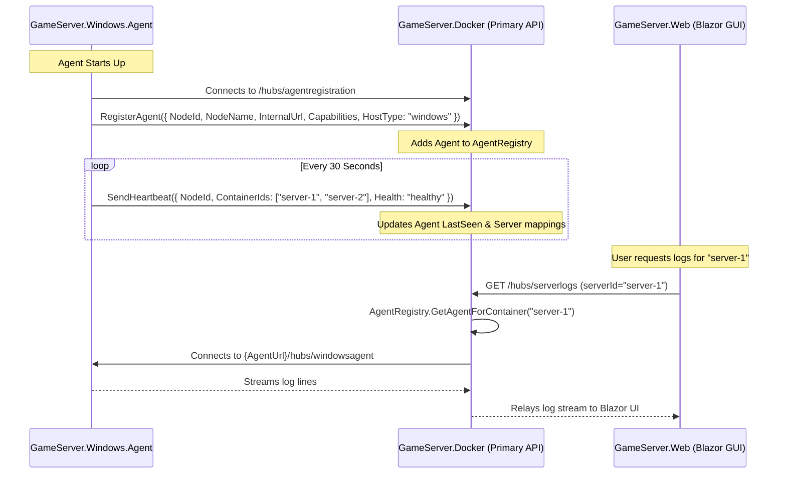

# Windows Agent Setup & Primary API Communication Guide

This guide explains how **`GameServer.Windows.Agent`** functions, how it communicates with the **Primary API (`GameServer.Docker`)**, and how to configure both components for seamless orchestration.

---

## 1. Overview: Dual Agent Architecture

Game Server Manager supports two distinct hosting paradigms:

| Environment | Agent Service | Hosting Unit | Core Technologies |
|---|---|---|---|
| **Docker Swarm Nodes** | `GameServer.Docker.Agent` | Container Replicas | Docker Socket, Swarm API, Overlay Network |
| **Windows Hosts** | `GameServer.Windows.Agent` | Native Windows Processes | SteamCMD CLI, Win32 Job Objects, ConPTY/Stdin, RCON |

```
┌─────────────────────────────────────────────────────────────────────────────┐
│                       Primary API (GameServer.Docker)                       │
│                                                                             │
│  ┌───────────────────────────────────────────────────────────────────────┐  │
│  │                            AgentRegistry                              │  │
│  │  - Maps Server/Container IDs → Agent Endpoint                         │  │
│  │  - Tracks Agent Health & Roles (Docker Manager vs Windows Host)       │  │
│  └───────────────────────────────────▲───────────────────────────────────┘  │
│                                      │                                      │
│                ┌─────────────────────┴─────────────────────┐                │
│                │ SignalR Registration & Heartbeats         │                │
│                │ (/hubs/agentregistration)                 │                │
└────────────────┼───────────────────────────────────────────┼────────────────┘
                 │                                           │
┌────────────────▼────────────────────────┐ ┌────────────────▼────────────────┐
│   GameServer.Docker.Agent (Docker Node) │ │ GameServer.Windows.Agent (Win) │
│   - Interacts with local Docker daemon  │ │ - Interacts with SteamCMD CLI   │
│   - Discovers & monitors containers     │ │ - Win32 Job Object Supervision  │
│   - Runs inside Swarm overlay network   │ │ - Runs as Native Windows Service│
└─────────────────────────────────────────┘ └─────────────────────────────────┘
```

Both agents register back to the central Primary API through the exact same SignalR hub (`/hubs/agentregistration`), allowing the frontend UI to interact with both Linux/Docker and Windows servers uniformly.

---

## 2. How the Windows Agent Functions

### A. SteamCMD Lifecycle & Dedicated Server Deployment
1. **Automated Bootstrapping**:
   When the agent starts, it verifies if `steamcmd.exe` exists in `SteamCmd:SteamCmdDirectory` (default: `C:\GameServers\_steamcmd`). If missing, it downloads `steamcmd.zip` from Valve's official CDN (`https://steamcdn-a.akamaihd.net/client/installer/steamcmd.zip`) and extracts it automatically.
2. **App Installation & Updating**:
   When an install or update command is received, the agent generates and executes the SteamCMD command line:
   ```cmd
   steamcmd.exe +force_install_dir "C:\GameServers\instances\server-01" +login anonymous +app_update 2394010 validate +quit
   ```
3. **Real-Time Progress Streaming**:
   `SteamCmdOutputParser` uses regex patterns to parse the raw stdout stream in real time, emitting structured events:
   - `State = "downloading"`, `ProgressPercent = 45.2%`, `BytesDownloaded = 123456789`, `TotalBytes = 273123456`
   - `State = "validating"`, `ProgressPercent = 80.5%`
   - `State = "Completed"`, `ProgressPercent = 100.0%`
4. **Workshop Mod Downloads**:
   Downloads mod items via `+workshop_download_item <appId> <workshopId>` into server directories.

---

### B. Windows Process Supervision with Win32 Job Objects
Dedicated game servers on Windows often consist of launcher scripts (`.bat` / `.cmd` / `.ps1`) or wrapper executables (e.g. `PalServer.exe`) that spawn sub-processes (e.g. `PalServer-Win64-Shipping.exe`).

If you terminate only the parent process in Windows, the child process remains running in the background as an orphaned process, holding ports open and locking save files.

`GameServer.Windows.Agent` solves this via native **Win32 Job Objects**:
1. When starting a server, a dedicated Win32 Job Object is created with the `JOB_OBJECT_LIMIT_KILL_ON_JOB_CLOSE` flag (`0x2000`).
2. The spawned process handle is assigned to the Job Object via `AssignProcessToJobObject`.
3. Any child or grandchild process spawned by the game is automatically assigned to the same Job Object by the Windows kernel.
4. When the server is stopped or crashes, closing the Job Object handle guarantees that the **entire process tree is terminated instantly by the Windows kernel**.

```
┌────────────────────────────────────────────────────────┐
│               Win32 Job Object Container               │
│                                                        │
│   ┌────────────────────────────────────────────────┐   │
│   │ Parent Launcher Process (e.g. PalServer.exe)   │   │
│   └───────────────────────┬────────────────────────┘   │
│                           │ Spawns                     │
│   ┌───────────────────────▼────────────────────────┐   │
│   │ Game Binary (PalServer-Win64-Shipping.exe)     │   │
│   └────────────────────────────────────────────────┘   │
└────────────────────────────────────────────────────────┘
  ▲
  └── On Stop: Kernel terminates ALL processes in the Job Object
```

---

### C. Logging, Console & RCON
- **Circular Log Ring Buffer** (`ProcessLogRingBuffer`):
  Each running server maintains an in-memory thread-safe circular buffer (default: 2,000 lines). Logs are captured asynchronously from `stdout` and `stderr` without blocking process execution.
- **SignalR Log Streaming**:
  Clients subscribe to `/hubs/windowsagent` using `StreamServerLogs(serverId)`. The hub replays the last N historical lines immediately, then streams live lines as they are produced.
- **Interactive Console Input & RCON**:
  - Console commands can be written directly to the process's standard input stream (`process.StandardInput.WriteLineAsync`).
  - For servers requiring RCON (Source engine, Palworld, Ark), the agent includes a native asynchronous `RconClient` to execute commands over TCP.

---

### D. Host Port & Resource Diagnostics
- **Active Listener Inspection** (`WindowsPortService`):
  Before starting a server or assigning ports, the agent queries `IPGlobalProperties.GetActiveTcpListeners()` and `GetActiveUdpListeners()` to detect any port conflicts on the host.
- **Host & Process Telemetry** (`WindowsResourceMonitor`):
  Queries physical RAM (`GlobalMemoryStatusEx`), CPU percentage deltas, and disk drive capacities, streaming updates over SignalR.

---

## 3. Communication Setup with Primary API

### A. Push Registration & Heartbeat Flow



---

### B. Capabilities Negotiation
When the Windows Agent registers, it advertises the following capabilities:
```json
[
  "steamcmd",
  "windows-process",
  "process-exec",
  "stats",
  "logs",
  "files",
  "ports"
]
```
The Primary API uses these capabilities to determine available operations:
- For Docker nodes: container inspect, image pull, swarm service creation.
- For Windows nodes: SteamCMD updates, native executable launch, Windows file management.

---

### C. Network & Firewall Configuration

1. **Inbound Port on Windows Agent Host**:
   - Default Port: `5180` (HTTP)
   - Ensure the Windows Firewall allows incoming TCP traffic on port `5180` from the Primary Service:
     ```powershell
     New-NetFirewallRule -DisplayName "GameServer Windows Agent (Port 5180)" `
                         -Direction Inbound `
                         -LocalPort 5180 `
                         -Protocol TCP `
                         -Action Allow
     ```

2. **Outbound Connection to Primary API**:
   - The Windows Agent must be able to reach the Primary Service URL (e.g. `http://primary-api-host:5164`).
   - If the Primary Service is hosted on Docker Swarm or behind a reverse proxy, ensure the `/hubs/agentregistration` SignalR endpoint is exposed to the local network or VPN.

3. **Game Ports**:
   - Remember to open the specific UDP/TCP ports required by your game servers (e.g., Palworld `8211/UDP`, Valheim `2456-2458/UDP`, Ark `7777/UDP`, etc.).

---

## 4. Step-by-Step Setup Guide

### Step 1: Configure the Windows Agent (`appsettings.json`)

On the Windows machine, open `src/GameServer.Windows.Agent/appsettings.json` (or your published directory):

```json
{
  "WindowsAgent": {
    "AgentPort": "5180",
    "SteamCmd": {
      "SteamCmdDirectory": "C:\\GameServers\\_steamcmd",
      "AutoDownloadIfMissing": true,
      "DefaultTimeoutMinutes": 30
    },
    "Storage": {
      "BaseInstancesDirectory": "C:\\GameServers\\instances",
      "BackupsDirectory": "C:\\GameServers\\backups"
    },
    "ProcessSupervision": {
      "GracefulStopTimeoutSeconds": 30,
      "LogBufferSizeLines": 2000,
      "EnableCrashRestart": true,
      "MaxRestartRetries": 5
    },
    "AgentRegistration": {
      "Enabled": true,
      "PrimaryServiceUrl": "http://192.168.1.100:5164",
      "HeartbeatIntervalSeconds": 30
    }
  }
}
```

> **Note**: Replace `http://192.168.1.100:5164` with the actual IP/hostname of your Primary API server.

---

### Step 2: Test Run Interactively (Console Mode)

Before installing as a service, verify connectivity in an interactive console:

```powershell
cd src/GameServer.Windows.Agent
dotnet run --urls "http://0.0.0.0:5180"
```

Expected output:
```
[10:15:00 INF] Starting GameServer.Windows.Agent Version 0.0.1 on GAMESTATION-01
[10:15:01 INF] Windows Agent identity initialized: NodeId=win-gamestation-01, NodeName=GAMESTATION-01, AgentUrl=http://192.168.1.150:5180
[10:15:01 INF] Windows Agent connecting to Primary Service at http://192.168.1.100:5164/hubs/agentregistration
[10:15:02 INF] Connected to Primary Service SignalR hub
[10:15:02 INF] Registered Windows Agent with Primary Service: Node=GAMESTATION-01 (win-gamestation-01)
```

You can view the interactive Scalar API documentation by opening:
```
http://localhost:5180/scalar/v1
```

---

### Step 3: Deploy as a Production Windows Service

1. **Publish the Application**:
   ```powershell
   dotnet publish src/GameServer.Windows.Agent/GameServer.Windows.Agent.csproj `
                  -c Release `
                  -r win-x64 `
                  --self-contained false `
                  -o C:\Services\GameServer.Windows.Agent
   ```

2. **Create the Windows Service**:
   Open an **Administrator PowerShell** prompt:
   ```powershell
   New-Service -Name "GameServerWindowsAgent" `
               -BinaryPathName "C:\Services\GameServer.Windows.Agent\GameServer.Windows.Agent.exe --urls http://0.0.0.0:5180" `
               -DisplayName "GameServer Windows Agent" `
               -Description "Orchestrates SteamCMD updates and native Windows game server processes." `
               -StartupType Automatic
   ```

3. **Start the Service**:
   ```powershell
   Start-Service -Name "GameServerWindowsAgent"
   ```

4. **Verify Service Status**:
   ```powershell
   Get-Service -Name "GameServerWindowsAgent"
   ```

---

## 5. Testing Game Server Deployment

### Scenario: Deploying Palworld Dedicated Server on Windows

1. **Install Game Files via SteamCMD**:
   ```http
   POST http://localhost:5180/api/steamcmd/install
   Content-Type: application/json

   {
     "appId": 2394010,
     "installDirectory": "C:\\GameServers\\instances\\palworld-01",
     "validate": true,
     "anonymousLogin": true
   }
   ```

2. **Start the Server Process**:
   ```http
   POST http://localhost:5180/api/servers/start
   Content-Type: application/json

   {
     "serverId": "palworld-01",
     "name": "Palworld Dedicated Server",
     "executablePath": "PalServer.exe",
     "arguments": "-port=8211 -players=16 -log -useperfthreads",
     "workingDirectory": "C:\\GameServers\\instances\\palworld-01",
     "autoRestart": true
   }
   ```

3. **View Real-Time Logs**:
   ```http
   GET http://localhost:5180/api/servers/palworld-01/logs?tail=50
   ```
   Or connect your SignalR client to:
   ```
   ws://localhost:5180/hubs/windowsagent
   -> Invoke StreamServerLogs("palworld-01")
   ```

4. **Stop the Server Process Cleanly**:
   ```http
   POST http://localhost:5180/api/servers/palworld-01/stop
   Content-Type: application/json

   {
     "gracefulTimeoutSeconds": 15,
     "force": false
   }
   ```

---

## 6. Troubleshooting Checklist

| Issue | Likely Cause | Solution |
|---|---|---|
| **Agent fails to register with Primary API** | Incorrect URL or network blockage | Verify `PrimaryServiceUrl`. Test connectivity with `curl http://primary-host:5164/hubs/agentregistration`. |
| **`steamcmd.exe` download fails** | No internet access or permission denied | Ensure the agent can reach `https://steamcdn-a.akamaihd.net` and has write access to `SteamCmdDirectory`. |
| **Port shows in use when starting server** | Another process is holding the port | Use `GET /api/ports/check?port=XXXX&protocol=udp` or `netstat -ano \| findstr XXXX` in cmd to identify the conflict. |
| **Child processes linger after stopping** | Process not assigned to Job Object | Ensure the Windows Agent service is running with Administrator/LocalSystem rights to utilize Win32 Job Objects. |
| **SignalR WebSockets connection fails** | Proxy or firewall blocking WebSockets | Ensure reverse proxies (e.g. Nginx/Traefik) enable `Upgrade` and `Connection` headers for WebSockets. |

---

## 7. Related Documentation

- [Architecture Overview](../ARCHITECTURE.md)
- [Agent Registration Flow](Agent-Registration-Flow.md)
- [Terminal & Console Guide](Terminal-And-Console.md)
- [Current Features Inventory](../CURRENT-FEATURES.md)
