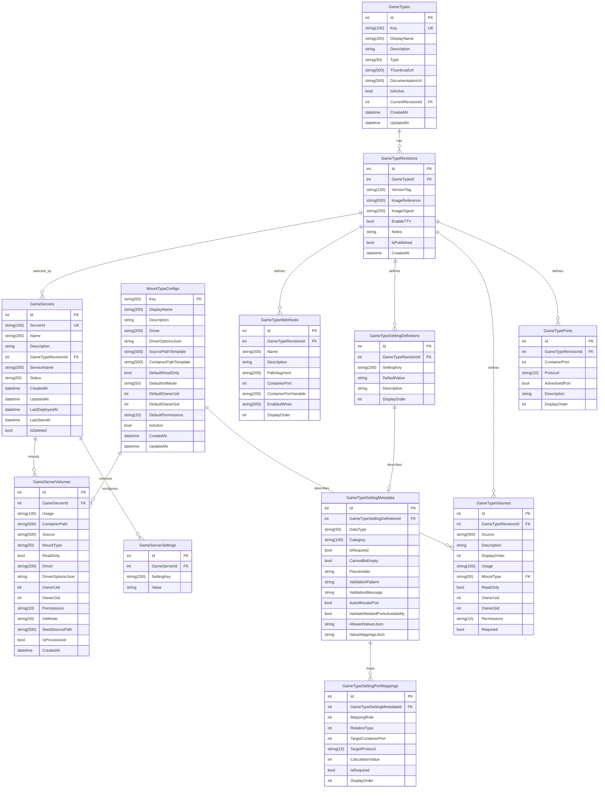
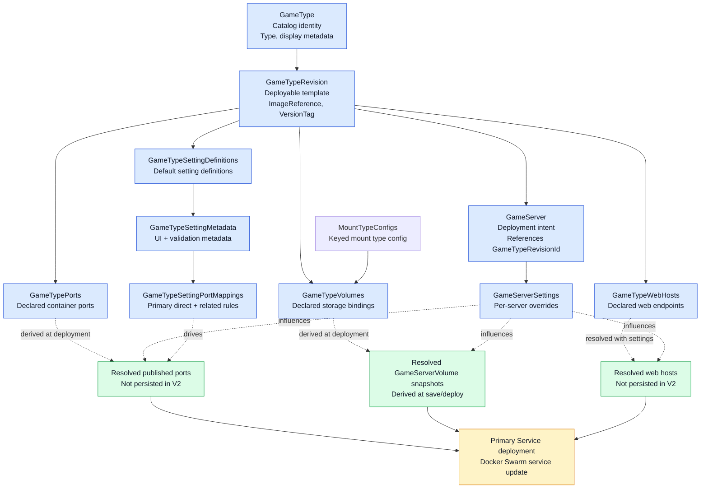

# V2 Database Diagram

This diagram reflects the current V2 persistence structures implemented in `src/GameServer.Docker/Data/V2/Entities.cs` and mirrored by the PostgreSQL project in `src/GameServer.DB.PostgreSql`.

## Entity Relationship Diagram

The `VolumeSetupConfig` and `VolumeDriverConfigOptions` types have been removed. Storage paths and driver options now live in the keyed `MountTypeConfigs` table, referenced loosely by `GameTypeVolumes.MountType`.

## V2 Deployment Flow Diagram

Legend:
- Blue = persisted V2 tables
- Green = deployment-time derived state or per-server resolved snapshots
- Amber = deployment output / orchestration target

## Table Definitions

### `GameTypes`

| Column | Data Type | Nullability | Key / Constraint | Description |
|---|---|---|---|---|
| `Id` | `int` | Not Null | Primary Key | Internal identifier for the catalog entry. |
| `Key` | `string` | Not Null | Unique | Stable logical identifier such as `minecraft` or `valheim`. |
| `DisplayName` | `string` | Not Null |  | User-facing name shown in editors and selection UIs. |
| `Description` | `string` | Nullable |  | Human-readable summary of the game type. |
| `Type` | `string` | Not Null |  | Catalog/provider type, currently expected to be values such as `docker`. |
| `ThumbnailUrl` | `string` | Nullable |  | Optional image used for catalog display in the UI. |
| `DocumentationUrl` | `string` | Nullable |  | Optional reference to image or game setup documentation. |
| `IsActive` | `bool` | Not Null |  | Indicates whether the game type should be available for new server creation. |
| `CurrentRevisionId` | `int` | Nullable | Foreign Key -> `GameTypeRevisions.Id` | Points to the currently recommended published revision for this game type. |
| `CreatedAt` | `datetime` | Not Null |  | Audit timestamp for when the catalog entry was created. |
| `UpdatedAt` | `datetime` | Not Null |  | Audit timestamp for the last metadata change to the catalog entry. |

### `GameTypeRevisions`

| Column | Data Type | Nullability | Key / Constraint | Description |
|---|---|---|---|---|
| `Id` | `int` | Not Null | Primary Key | Internal identifier for the frozen deployable revision. |
| `GameTypeId` | `int` | Not Null | Foreign Key -> `GameTypes.Id` | Associates the revision to the parent game type it belongs to. |
| `VersionTag` | `string` | Not Null | Unique with `GameTypeId` + `ImageReference` | Docker image tag represented by this revision. |
| `ImageReference` | `string` | Not Null | Unique with `GameTypeId` + `VersionTag` | Deployable Docker image reference owned by the revision rather than by `GameTypes`. |
| `ImageDigest` | `string` | Nullable |  | Optional digest captured for the tagged image when the revision was created or published. |
| `EnableTTY` | `bool` | Not Null |  | Indicates whether the deployed service should enable TTY for this revision. |
| `Notes` | `string` | Nullable |  | Optional release or authoring notes describing what changed in this revision. |
| `IsPublished` | `bool` | Not Null |  | Indicates whether this revision is available for use by server instances. |
| `CreatedAt` | `datetime` | Not Null |  | Audit timestamp for when the revision was created. |

### `GameTypePorts`

| Column | Data Type | Nullability | Key / Constraint | Description |
|---|---|---|---|---|
| `Id` | `int` | Not Null | Primary Key | Internal identifier for the revisioned port definition. |
| `GameTypeRevisionId` | `int` | Not Null | Foreign Key -> `GameTypeRevisions.Id` | Associates the port definition with the frozen revision that owns it. |
| `ContainerPort` | `int` | Not Null |  | Container port exposed by the image or expected by the deployable template. |
| `Protocol` | `string` | Not Null |  | Transport protocol for this port, typically `tcp` or `udp`. |
| `AdvertisedPort` | `bool` | Not Null |  | Marks the single user-facing primary connection port for the revision. |
| `Description` | `string` | Nullable |  | Human-readable purpose of the port such as game, query, or admin access. |
| `DisplayOrder` | `int` | Not Null |  | UI ordering for port presentation and generated summaries. |

### `MountTypeConfigs`

| Column | Data Type | Nullability | Key / Constraint | Description |
|---|---|---|---|---|
| `Key` | `string(50)` | Not Null | Primary Key | String code for the mount type (`volume`, `bind`, `tmpfs`, `nfs`). Referenced loosely by `GameTypeVolumes.MountType`. |
| `DisplayName` | `string(200)` | Not Null |  | Human-readable label shown in the UI. |
| `Description` | `string` | Nullable |  | Optional explanation of when to use this mount type. |
| `Driver` | `string(200)` | Nullable |  | Docker named-volume driver used for `volume`-style mounts. |
| `DriverOptionsJson` | `string` | Nullable |  | Optional default driver options serialized as JSON. |
| `SourcePathTemplate` | `string(500)` | Nullable |  | Template used to build the host source path or volume name. Tokens: `{gameTypeKey}`, `{serverId}`, `{Source}`. |
| `ContainerPathTemplate` | `string(500)` | Nullable |  | Template used to build the container target path. Token: `{Source}`. |
| `DefaultReadOnly` | `bool` | Not Null | Default `false` | Default read-only flag applied when resolving volumes of this type. |
| `DefaultInitMode` | `string(50)` | Not Null | Default `none` | Default initialization behavior for resolved snapshots. |
| `DefaultOwnerUid` | `int` | Nullable |  | Default UID applied when no revision override is present. |
| `DefaultOwnerGid` | `int` | Nullable |  | Default GID applied when no revision override is present. |
| `DefaultPermissions` | `string(10)` | Nullable |  | Default permissions string applied when no revision override is present. |
| `IsActive` | `bool` | Not Null | Default `true` | Whether this mount type is available for use. |
| `CreatedAt` | `datetime` | Not Null |  | Audit timestamp for when the config row was created. |
| `UpdatedAt` | `datetime` | Not Null |  | Audit timestamp for the last config change. |

### `GameTypeVolumes`

| Column | Data Type | Nullability | Key / Constraint | Description |
|---|---|---|---|---|
| `Id` | `int` | Not Null | Primary Key | Internal identifier for the revisioned volume definition. |
| `GameTypeRevisionId` | `int` | Not Null | Foreign Key -> `GameTypeRevisions.Id` | Associates the volume with the revision that defines it. |
| `Source` | `string(500)` | Not Null |  | Container path where the mount is attached; also provides the `{Source}` token value. |
| `Description` | `string` | Nullable |  | Human-readable purpose of the volume such as config, world, or mods. |
| `DisplayOrder` | `int` | Not Null |  | UI ordering for volume presentation. |
| `Usage` | `string(100)` | Not Null |  | Semantic classification used by deployment logic to determine how the binding should be generated. |
| `MountType` | `string(50)` | Not Null | Foreign Key -> `MountTypeConfigs.Key` (soft, not enforced on existing data) | Mount type code used to look up templates and defaults at resolution time. |
| `ReadOnly` | `bool` | Not Null | Default `false` | Whether the mount is read-only at runtime. |
| `OwnerUid` | `int` | Nullable |  | Optional UID override applied to the resolved mount. |
| `OwnerGid` | `int` | Nullable |  | Optional GID override applied to the resolved mount. |
| `Permissions` | `string(10)` | Nullable |  | Optional permissions string override applied to the resolved mount. |
| `Required` | `bool` | Not Null | Default `true` | Whether the volume must exist for the server to be deployable. |

### `GameTypeSettingDefinitions`

| Column | Data Type | Nullability | Key / Constraint | Description |
|---|---|---|---|---|
| `Id` | `int` | Not Null | Primary Key | Internal identifier for the setting definition. |
| `GameTypeRevisionId` | `int` | Not Null | Foreign Key -> `GameTypeRevisions.Id` | Associates the setting definition with the revision that owns it. |
| `SettingKey` | `string` | Not Null | Unique with `GameTypeRevisionId` | Environment variable or authored setting key consumed during deployment. |
| `DefaultValue` | `string` | Nullable |  | Default value used when a server does not provide an override. |
| `Description` | `string` | Nullable |  | Human-readable explanation of what the setting controls. |
| `DisplayOrder` | `int` | Not Null |  | UI ordering for editors and review screens. |

### `GameTypeSettingMetadata`

| Column | Data Type | Nullability | Key / Constraint | Description |
|---|---|---|---|---|
| `Id` | `int` | Not Null | Primary Key | Internal identifier for the setting metadata row. |
| `GameTypeSettingDefinitionId` | `int` | Not Null | Foreign Key -> `GameTypeSettingDefinitions.Id`; Unique | One-to-one metadata row describing how a setting should be rendered and interpreted. |
| `DataType` | `string` | Nullable |  | Semantic type used by the UI and backend interpretation, commonly `string`, `number`, `boolean`, `enum`, or `port`. |
| `Category` | `string` | Nullable |  | Optional UI grouping label used to organize settings in editors. |
| `IsRequired` | `bool` | Not Null |  | Indicates whether the setting must be provided before deployment. |
| `CannotBeEmpty` | `bool` | Not Null |  | Indicates whether the setting may be present but blank. |
| `Placeholder` | `string` | Nullable |  | UI hint shown when the setting value is empty. |
| `ValidationPattern` | `string` | Nullable |  | Optional regex or pattern used to validate the setting value. |
| `ValidationMessage` | `string` | Nullable |  | Error text presented when the validation pattern fails. |
| `AutoAllocatePort` | `bool` | Not Null |  | Indicates whether backend services may automatically assign published ports for this setting. |
| `ValidateRelatedPortsAvailability` | `bool` | Not Null |  | Indicates whether related port mappings should be checked together for availability before deployment or update. |
| `AllowedValuesJson` | `string` | Nullable |  | Serialized list of allowed values used to render enum-like pickers. |
| `ValueMappingsJson` | `string` | Nullable |  | Serialized key-to-label mappings used to display friendly values in the UI. |

### `GameTypeSettingPortMappings`

| Column | Data Type | Nullability | Key / Constraint | Description |
|---|---|---|---|---|
| `Id` | `int` | Not Null | Primary Key | Internal identifier for the port mapping rule. |
| `GameTypeSettingMetadataId` | `int` | Not Null | Foreign Key -> `GameTypeSettingMetadata.Id` | Associates the mapping rule with the port-type setting metadata that owns it. |
| `MappingRole` | `int` | Not Null | Check constraint | Enum-backed role where `0 = Primary` and `1 = Related`. |
| `RelationType` | `int` | Not Null | Check constraint | Enum-backed relation where `0 = Direct`, `1 = Offset`, `2 = Fixed`, `3 = Multiplier`. |
| `TargetContainerPort` | `int` | Not Null |  | For primary mappings, the direct target GameType port; for related mappings, the default related GameType port that must match the relation calculation. |
| `TargetProtocol` | `string` | Not Null |  | Protocol associated with the target container port. |
| `CalculationValue` | `int` | Nullable |  | Single calculation operand interpreted according to `RelationType` and `MappingRole`; used by related mappings. |
| `IsRequired` | `bool` | Not Null |  | Indicates whether this derived mapping must exist for the setting to be considered valid. |
| `DisplayOrder` | `int` | Not Null |  | UI ordering for displaying related mappings. |

### `GameTypeWebHosts`

| Column | Data Type | Nullability | Key / Constraint | Description |
|---|---|---|---|---|
| `Id` | `int` | Not Null | Primary Key | Internal identifier for the authored Web Host definition. |
| `GameTypeRevisionId` | `int` | Not Null | Foreign Key -> `GameTypeRevisions.Id` | Associates the Web Host definition with the revision that owns it. |
| `Name` | `string` | Not Null |  | Human-readable name of the web-accessible endpoint such as admin UI or map view. |
| `Description` | `string` | Nullable |  | Summary of the endpoint and what it exposes. |
| `PathSegment` | `string` | Nullable |  | Static or templated path segment used when generating route paths. |
| `ContainerPort` | `int` | Nullable |  | Static container port used when the endpoint does not resolve its port from a setting. |
| `ContainerPortVariable` | `string` | Nullable |  | Setting key used to resolve the effective container port dynamically from `GameServerSettings`. |
| `EnabledWhen` | `string` | Nullable |  | Conditional expression used to determine whether the endpoint should be generated for a server. |
| `DisplayOrder` | `int` | Not Null |  | UI and generation ordering for Web Host processing. |

### `GameServers`

| Column | Data Type | Nullability | Key / Constraint | Description |
|---|---|---|---|---|
| `Id` | `int` | Not Null | Primary Key | Internal identifier for the persisted server instance. |
| `ServerId` | `string` | Not Null | Unique | Stable external identifier used for API access, service labels, and runtime correlation. |
| `Name` | `string` | Not Null |  | User-facing server name. |
| `Description` | `string` | Nullable |  | Optional description of the server instance. |
| `GameTypeRevisionId` | `int` | Not Null | Foreign Key -> `GameTypeRevisions.Id` | Single schema reference describing the frozen deployable template for the server. |
| `ServiceName` | `string` | Not Null |  | Docker Swarm service name or generated identity used during deployment and updates. |
| `Status` | `string` | Not Null |  | Desired or observed deployment status for the server instance. |
| `CreatedAt` | `datetime` | Not Null |  | Audit timestamp for when the server record was created. |
| `UpdatedAt` | `datetime` | Not Null |  | Audit timestamp for the last server metadata or settings update. |
| `LastDeployedAt` | `datetime` | Nullable |  | Timestamp for the last deploy or update operation. |
| `LastSeenAt` | `datetime` | Nullable |  | Timestamp for the last observed runtime correlation or heartbeat-derived state. |
| `IsDeleted` | `bool` | Not Null |  | Soft-delete marker used to hide or retire servers without immediately removing audit history. |

### `GameServerSettings`

| Column | Data Type | Nullability | Key / Constraint | Description |
|---|---|---|---|---|
| `Id` | `int` | Not Null | Primary Key | Internal identifier for the server-specific setting row. |
| `GameServerId` | `int` | Not Null | Foreign Key -> `GameServers.Id` | Associates the setting override with the server instance that owns it. |
| `SettingKey` | `string` | Not Null | Unique with `GameServerId` | Setting or environment variable key being overridden for this server. |
| `Value` | `string` | Nullable |  | Desired value supplied for deployment; list-like values may remain newline-separated when required by existing behavior. |

### `GameServerVolumes`

| Column | Data Type | Nullability | Key / Constraint | Description |
|---|---|---|---|---|
| `Id` | `int` | Not Null | Primary Key | Internal identifier for the resolved per-server volume snapshot. |
| `GameServerId` | `int` | Not Null | Foreign Key -> `GameServers.Id` | Associates the resolved mount with the server instance. |
| `Usage` | `string(100)` | Not Null |  | Semantic classification copied from the source volume definition. |
| `ContainerPath` | `string(500)` | Not Null |  | Target path inside the container. |
| `Source` | `string(500)` | Not Null |  | Resolved host- or driver-specific source for the mount. |
| `MountType` | `string(50)` | Not Null | Default `volume` | How the mount is materialized (`volume`, `bind`, `tmpfs`, `nfs`). |
| `ReadOnly` | `bool` | Not Null | Default `false` | Whether the mount is read-only at runtime. |
| `Driver` | `string(200)` | Not Null | Default `local` | Volume driver snapshot from the resolved mount type config. |
| `DriverOptionsJson` | `string` | Nullable |  | Snapshot of driver options from the resolved mount type config. |
| `OwnerUid` | `int` | Nullable |  | UID applied to the mounted path. |
| `OwnerGid` | `int` | Nullable |  | GID applied to the mounted path. |
| `Permissions` | `string(10)` | Nullable |  | Permissions string applied to the mounted path. |
| `InitMode` | `string(50)` | Not Null | Default `none` | How the volume should be initialized. |
| `SeedSourcePath` | `string(500)` | Nullable |  | Optional source path used when initializing volume contents. |
| `IsProvisioned` | `bool` | Not Null | Default `false` | Whether the volume has been provisioned on the underlying host. |
| `CreatedAt` | `datetime` | Not Null |  | Audit timestamp for when the snapshot was created. |

## Notes

- `GameTypes` is the logical catalog root.
- `GameTypes` stores catalog identity and high-level type metadata.
- `GameTypeRevisions` is the frozen deployable template and owns both `ImageReference` and `VersionTag`.
- `GameServers` stores deployment intent, not full runtime state.
- `GameServers` references `GameTypeRevisionId` and should derive game type and image details through that revision instead of duplicating them.
- Web Host state should be derived from `GameTypeWebHosts` plus `GameServerSettings`, not stored separately in V2.
- `GameTypeSettingPortMappings` stores both primary and related port rules for a setting.
- Primary port mappings are direct mappings to declared `GameTypePorts`; related mappings represent default related port/protocol combinations plus a relation calculation.
- Port mapping descriptions are not persisted in V2; the UI should display the linked `GameTypePorts.Description` instead.
- `CalculationValue` is interpreted according to `RelationType`, instead of using separate offset/fixed/multiplier columns.
- `GameServerPorts` and resolved web host snapshots are intentionally excluded from V2.
- `GameServerVolumes` are persisted as per-server resolved snapshots so that deployment and agents have a stable source of truth for volume mounts.
- `MountTypeConfigs` is a keyed table that supplies the templates, driver, driver options, and defaults used when resolving `GameTypeVolumes` into `GameServerVolumes`.
- `VolumeSetupConfig` and `VolumeDriverConfigOptions` have been removed; storage paths and driver options now live in `MountTypeConfigs.Key`-specific rows.
- `CurrentRevisionId` is an optional selector on `GameTypes` and is not currently expressed as a physical foreign key in the PostgreSQL project.
- Runtime deployment state such as resolved ports, resolved volume bindings, and resolved web hosts is computed from revision definitions plus `GameServerSettings` instead of being persisted in dedicated V2 tables.

## Key constraints

- `GameTypes.Key` is unique.
- `GameServers.ServerId` is unique.
- Each `GameTypeRevision` should have exactly one `GameTypePorts` row where `AdvertisedPort = true`.
- `GameTypeSettingDefinitions` should be unique per `GameTypeRevisionId + SettingKey`.
- `GameServerSettings` should be unique per `GameServerId + SettingKey`.

