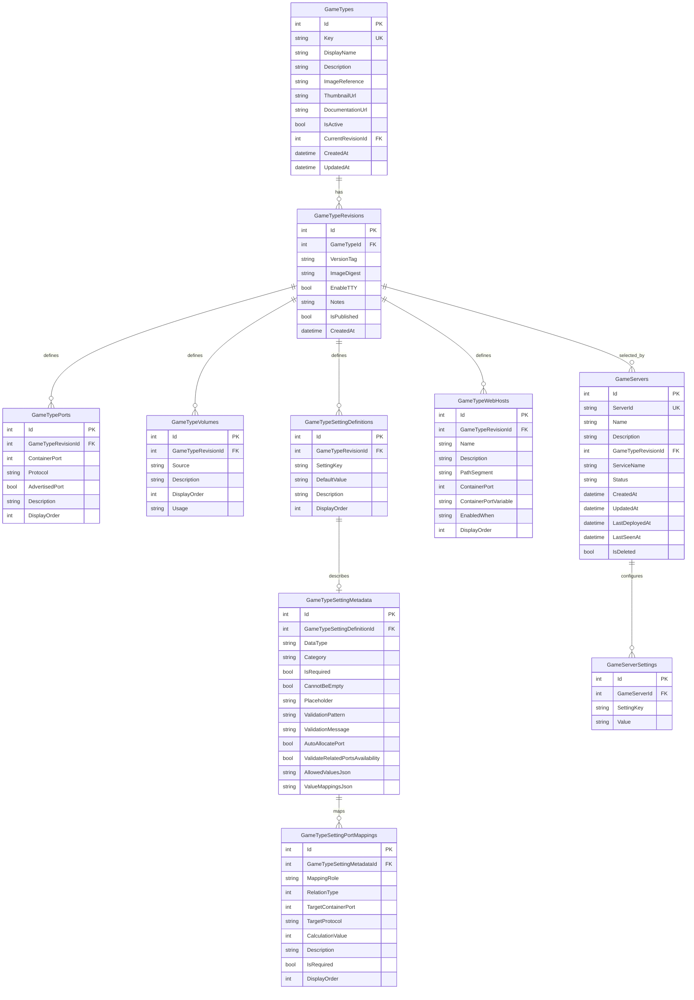

# V2 Database Diagram

This diagram reflects the intended V2 database layout described in `docs/DATABASE-REORGANIZATION-PROPOSAL.md`.

## Entity Relationship Diagram

## Notes

- `GameTypes` is the logical catalog root.
- `GameTypes` owns the fixed Docker image reference for the game type.
- `GameTypeRevisions` is the frozen deployable template for a specific image tag of that fixed Docker image.
- `GameServers` stores deployment intent, not full runtime state.
- `GameServers` references `GameTypeRevisionId` and should derive game type and image details through that revision instead of duplicating them.
- Web Host state should be derived from `GameTypeWebHosts` plus `GameServerSettings`, not stored separately in V2.
- `GameTypeSettingPortMappings` stores both primary and related port rules for a setting.
- `CalculationValue` is interpreted according to `RelationType`, instead of using separate offset/fixed/multiplier columns.
- `GameServerPorts`, `GameServerVolumes`, and runtime snapshot tables are intentionally excluded from V2.
- if a different Docker image is needed for the same conceptual game, a new `GameType` should be created instead of changing the image on an existing one.

## Key constraints

- `GameTypes.Key` is unique.
- `GameServers.ServerId` is unique.
- Each `GameTypeRevision` should have exactly one `GameTypePorts` row where `AdvertisedPort = true`.
- `GameTypeSettingDefinitions` should be unique per `GameTypeRevisionId + SettingKey`.
- `GameServerSettings` should be unique per `GameServerId + SettingKey`.
